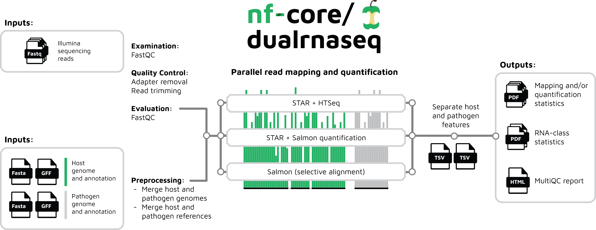

# 

## Dual RNA-seq pipeline

**nf-core/dualrnaseq** is a bioinformatics pipeline built using [Nextflow](https://www.nextflow.io), a workflow tool to run tasks across multiple compute infrastructures in a very portable manner. It comes with docker containers making installation trivial and results highly reproducible.

### Introduction

**nf-core/dualrnaseq** is specifically used for the analysis of Dual RNA-seq data, interrogating host-pathogen interactions through simultaneous RNA-seq.

This pipeline has been initially tested with eukaryotic host's including Human and Mouse, and pathogens including *Salmonella enterica*, *Orientia tsutsugamushi*, *Streptococcus penumoniae*, *Escherichia coli* and *Mycobacterium leprae*. The workflow should work with any eukaryotic and bacterial organisms with an available reference genome and annotation.

### Method

The workflow merges host and pathogen genome annotations taking into account differences in annotation conventions, then processes raw data from FastQ inputs ([FastQC](https://www.bioinformatics.babraham.ac.uk/projects/fastqc/), [BBDuk](https://jgi.doe.gov/data-and-tools/bbtools/bb-tools-user-guide/bbduk-guide/)),   quantifies gene expression ([STAR](https://github.com/alexdobin/STAR) and [HTSeq](https://htseq.readthedocs.io/en/master/); [STAR](https://github.com/alexdobin/STAR), [Salmon](https://combine-lab.github.io/salmon/) and [tximport](https://bioconductor.org/packages/release/bioc/html/tximport.html); or [Salmon](https://combine-lab.github.io/salmon/) in quasimapping mode and [tximport](https://bioconductor.org/packages/release/bioc/html/tximport.html)), and summarises the results ([MultiQC](http://multiqc.info/)), as well as generating a number of custom summary plots and separate results tables for the pathogen and host. See the [output documentation](docs/output.md) for more details.

### Workflow

The workflow diagram below gives a simplified visual overview of how dualrnaseq has been designed.

## Documentation

The nf-core/dualrnaseq pipeline comes with documentation about the pipeline, found in the `docs/` directory:

1. [Installation](https://nf-co.re/usage/installation)
2. Pipeline configuration
    * [Local installation](https://nf-co.re/usage/local_installation)
    * [Adding your own system config](https://nf-co.re/usage/adding_own_config)
    * [Reference genomes](https://nf-co.re/usage/reference_genomes)
    * [Parameters](docs/parameters.md)
3. [Running the pipeline](docs/usage.md)
4. [Output and how to interpret the results](docs/output.md)
5. [Troubleshooting](https://nf-co.re/usage/troubleshooting)

## Credits

nf-core/dualrnaseq was coded and written by Bozena Mika-Gospodorz and Regan Hayward.

We thank the following people for their extensive assistance in the development
of this pipeline:

## Contributions and Support

If you would like to contribute to this pipeline, please see the [contributing guidelines](.github/CONTRIBUTING.md).

For further information or help, don't hesitate to get in touch on the [Slack `#dualrnaseq` channel](https://nfcore.slack.com/channels/dualrnaseq) (you can join with [this invite](https://nf-co.re/join/slack)).

## Citations

You can cite the `nf-core` publication as follows:

> **The nf-core framework for community-curated bioinformatics pipelines.**
>
> Philip Ewels, Alexander Peltzer, Sven Fillinger, Harshil Patel, Johannes Alneberg, Andreas Wilm, Maxime Ulysse Garcia, Paolo Di Tommaso & Sven Nahnsen.
>
> _Nat Biotechnol._ 2020 Feb 13. doi: [10.1038/s41587-020-0439-x](https://dx.doi.org/10.1038/s41587-020-0439-x).
> ReadCube: [Full Access Link](https://rdcu.be/b1GjZ)

An extensive list of references for the tools used by the pipeline can be found in the [`CITATIONS.md`](CITATIONS.md) file.
