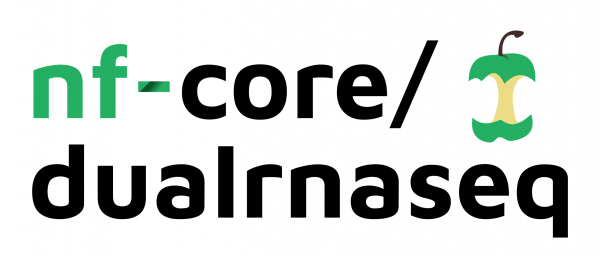

# 

# Contents

1. [Dual RNA-seq pipeline](introduction.md)
2. [Dual RNA-seq pipeline](introduction.md)
3. [Dual RNA-seq pipeline](introduction.md)
4. [Dual RNA-seq pipeline](introduction.md)
5. [Dual RNA-seq pipeline](introduction.md)
6. [Dual RNA-seq pipeline](introduction.md)

## Dual RNA-seq pipeline

Description of the pipeline and why important

## Documentation

The nf-core/dualrnaseq pipeline comes with documentation about the pipeline, found in the `docs/` directory:

1. [Introduction](introduction.md)
2. [Installation](https://nf-co.re/usage/installation)
3. Pipeline configuration
    * [Local installation](https://nf-co.re/usage/local_installation)
    * [Adding your own system config](https://nf-co.re/usage/adding_own_config)
    * [Reference genomes](https://nf-co.re/usage/reference_genomes)
    * [Parameters](parameters.md)
4. [Running the pipeline](usage.md)
5. [Output and how to interpret the results](output.md)
6. [Troubleshooting](https://nf-co.re/usage/troubleshooting)

## Nextflow

### Introduction

The pipeline is built using [Nextflow](https://www.nextflow.io), a workflow tool to run tasks across multiple compute infrastructures in a very portable manner. It comes with docker containers making installation trivial and results highly reproducible.

## Credits

nf-core/dualrnaseq was originally written by Bozena Mika-Gospodorz with support from Regan Hayward.

## Contributions and Support

If you would like to contribute to this pipeline, please see the [contributing guidelines](.github/CONTRIBUTING.md).

For further information or help, don't hesitate to get in touch on [Slack](https://nfcore.slack.com/channels/dualrnaseq) (you can join with [this invite](https://nf-co.re/join/slack)).

## Citation

<!-- TODO nf-core: Add citation for pipeline after first release. Uncomment lines below and update Zenodo doi. -->
<!-- If you use  nf-core/dualrnaseq for your analysis, please cite it using the following doi: [10.5281/zenodo.XXXXXX](https://doi.org/10.5281/zenodo.XXXXXX) -->

You can cite the `nf-core` publication as follows:

> **The nf-core framework for community-curated bioinformatics pipelines.**
>
> Philip Ewels, Alexander Peltzer, Sven Fillinger, Harshil Patel, Johannes Alneberg, Andreas Wilm, Maxime Ulysse Garcia, Paolo Di Tommaso & Sven Nahnsen.
>
> _Nat Biotechnol._ 2020 Feb 13. doi: [10.1038/s41587-020-0439-x](https://dx.doi.org/10.1038/s41587-020-0439-x).  
> ReadCube: [Full Access Link](https://rdcu.be/b1GjZ)
