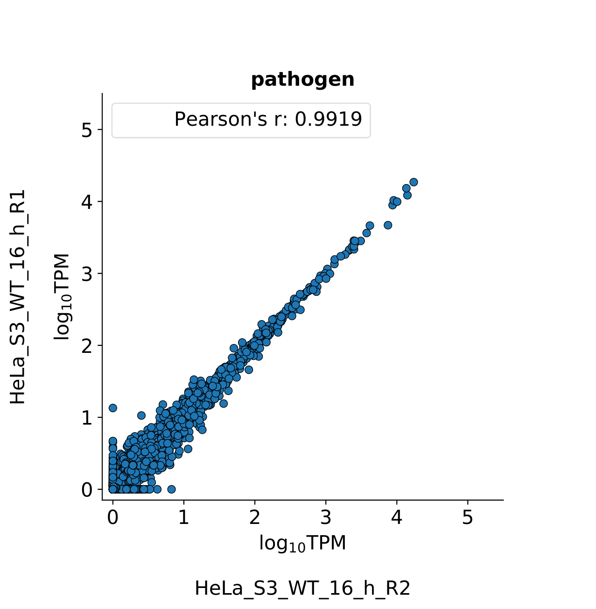

# nf-core/dualrnaseq: Output

## Pipeline overview

The pipeline is built using [Nextflow](https://www.nextflow.io/) and processes data using the following steps:

* [FastQC](#fastqc)
* [Trimming reads](#trimming-reads)
* [Mapping/Quantification](#mappingquantification)
   * [Salmon selective alignment](#A-Salmon-selective-alignment)
   * [STAR + Salmon - alignment based](#B-STAR--Salmon---alignment-based)
   * [STAR + HTSeq](#C-STAR--HTSeq)
* [MultiQC](#multiqc)
* [References](#References)
   * [Salmon Selective Alignment references](#Salmon-Selective-Alignment-references)
   * [Salmon-Alignment-based-mode-references](#Salmon-Alignment-based-mode-references)
   * [STAR and HTSeq references](#STAR-and-HTSeq-references)
* [Mapping statistics](#Mapping-statistics)
   * [STAR](###STAR-results-STAR)
   * [HTSeq](###HTSeq-results-HTSeq)
   * [Salmon](###Salmon-results-salmon)
   * [Salmon alignment based](###Salmon-alignment-based-results-salmon_alignment_based)
* [Pipeline info](#pipeline-info)

## FastQC

[FastQC](http://www.bioinformatics.babraham.ac.uk/projects/fastqc/) gives general quality metrics about your reads.
It provides information about the quality score distribution across your reads and the per base sequence content (%T/A/G/C).
Information about adapter contamination and other overrepresented sequences is also displayed.

**Output directory for raw reads:** `results/fastqc`

**Output directory for trimmed reads:** `results/fastqc_after_trimming`

Contents:

* `sample_fastqc.html` and `sample_trimmed_fastqc.html`
  * FastQC reports,`sample_fastqc.html` and  `sample_trimmed_fastqc.html` contain quality metrics for your untrimmed raw and trimmed fastq files, respectively. 
* `zips/sample_fastqc.zip` and `zips/sample_trimmed_fastqc.zip`
  * zip file containing the FastQC report, tab-delimited data file and plot images

For further reading and documentation see the [FastQC help](http://www.bioinformatics.babraham.ac.uk/projects/fastqc/Help/).

## Trimming reads

Two software options are provided to remove low quality reads and adapters: [Cutadapt](https://cutadapt.readthedocs.io/en/stable/) and [BBDuk](https://jgi.doe.gov/data-and-tools/bbtools/bb-tools-user-guide/bbduk-guide/).

All samples are processed in the output directory and appended with `_trimmed.fastq.gz`

**Output directory:** `results/trimming`

## Mapping/quantification

Depending on which mapping/quantification mode was selected, will depend on which folders and files appear here.

### A) Salmon selective alignment

**Output directory:** `results/salmon`

Contents:
* `transcripts_index`
  * All files produced by Salmon in the indexing phase.
* subfolders named as samples.
  * All files and folders produced by Salmon in the quantification step of Selective Alignment mode. You can learn more about salmon outputs in [`Salmon documentation`](https://salmon.readthedocs.io/en/latest/file_formats.html#fileformats). Each subfolder also contains separated quantification results from the host and pathogen stored in `host_quant.sf` and `pathogen_quant.sf` files, respectively. 
* `combined_quant.tsv` 
  * Tab delimited file containing combined quantification results of all samples processed by the pipeline. 
* `host_quant_salmon.tsv` and `pathogen_quant_salmon.tsv`
  * Tab delimited files containing combined quantification results for either host or pathogen from all samples.
* `host_combined_quant_annotations.tsv` and `pathogen_combined_quant_annotations.tsv`
  * Tab delimited files containing quantification results for either host or pathogen and annotations extracted from gff files including transcript_id, transcript_name, gene id, gene_name and	gene_type.
* `host_combined_gene_level.tsv`
  * Host gene-level estimates obtained using tximport.
* `host_combined_quant_gene_level_annotations.tsv`
  * Tab delimited file containing host gene-level estimates and annotations extracted from gff files including gene id, gene_name and	gene_type.

### B) STAR + Salmon - alignment based

**Output directory:** `results/STAR_for_salmon`

Contents:
* `index`
  * All files produced by STAR in the indexing phase.
* subfolders named as samples.
  * Files produced by STAR in the alignment step. The bam file generated in this mapping mode `sample_Aligned.sample_toTranscriptome.out.bam` contains alignments translated into transcript coordinates. See `Output in transcript coordinates` from the [`STAR documentation.`](https://physiology.med.cornell.edu/faculty/skrabanek/lab/angsd/lecture_notes/STARmanual.pdf)

**Output directory:** `results/salmon_alignment_mode`

Contents:
* subfolders named as samples
  * All files and folders produced by Salmon in the quantification step of Selective Alignment mode. You can learn more about salmon outputs in [`Salmon documentation`](https://salmon.readthedocs.io/en/latest/file_formats.html#fileformats). Each subfolder also contains separated quantification results from the host and pathogen stored in `host_quant.sf` and `pathogen_quant.sf` files, respectively. 
* `combined_quant.tsv` 
  * Tab delimited file containing combined quantification results of all samples processed by the pipeline. 
* `host_quant_salmon.tsv` and `pathogen_quant_salmon.tsv`
  * Tab delimited files containing combined quantification results for either host or pathogen from all samples.
* `host_combined_quant_annotations.tsv` and `pathogen_combined_quant_annotations.tsv`
  * Tab delimited files containing quantification results for either host or pathogen and annotations extracted from gff files including transcript_id, transcript_name, gene id, gene_name and	gene_type.
* `host_combined_gene_level.tsv`
  * Host gene-level estimates obtained using tximport.
* `host_combined_quant_gene_level_annotations.tsv`
  * Tab delimited file containing host gene-level estimates and annotations extracted from gff file including gene id, gene_name and	gene_type.

### C) STAR + HTSeq

**Output directory:** `results/STAR`

Contents:
* `index`
  * All files produced by STAR in the indexing phase.
* subfolders named as samples.
  * All files produced by STAR in the alignment step.
* `multimapped_reads`
  * This folder contains both `sample_cross_mapped_reads.txt` file with a list of cross-mapped reads between host and pathogen and `sample_no_crossmapped.bam` files with alignment without cross-mapped reads. 

**Output directory:** `results/HTSeq`

Contents:
* `sample_count_u_m.txt`
  * Quantification results for a sample.
* `quantification_results_uniquely_mapped.tsv` 
  * Tab delimited file containing combined quantification results of all samples processed by the pipeline. 
* `quantification_results_uniquely_mapped_NumReads_TPM.tsv` 
  * Tab delimited file containing HTSeq quantification results and TPM values estimated for each gene in each sample. To calculate TPM values, the length of genes was estimated based on gff annotation.
* `quantification_stats_uniquely_mapped.tsv` 
  * Statistics extracted from HTSeq quantification results.
* `host_quantification_uniquely_mapped_htseq.tsv` and `pathogen_quantification_uniquely_mapped_htseq.tsv`
  * Tab delimited files containing combined quantification results for either host or pathogen from all samples.
* `host_combined_quant_annotations.tsv` and `pathogen_combined_quant_annotations.tsv`
  * Tab delimited files containing quantification results for either host or pathogen and annotations extracted from gff files including gene_id, gene_name, gene_type and gene length.

## MultiQC

[MultiQC](http://multiqc.info) is a visualisation tool that generates a single HTML report summarising all samples in your project.

Most of the pipeline QC results are visualised in the report and further statistics are available in the report data directory.

The pipeline has special steps which allow the software versions used to be reported in the MultiQC output for future traceability.

**Output directory:** `results/MultiQC`

Contents:
* `ProjectName_multiqc_report.html`
  * MultiQC report - a standalone HTML file that can be viewed in your web browser
* `ProjectName_multiqc_report_data/`
  * Directory containing parsed statistics from the different tools used in the pipeline
* `multiqc_plots/`
  * Directory containing plots from within the .html report, saved as `PDF`, `PNG` and `SVG`

For more information about how to use MultiQC reports, see [http://multiqc.info](http://multiqc.info). 

## References

The pipeline creates chimeric references of the pathogen and host, and here you can find references used for the mapping, quantification and collecting statistics. 

Contents:

**Salmon Selective Alignment references:** 
* `host_pathogen.fasta`: 
  * Chimeric genome fasta file used as a decoy sequence in Salmon with Selective Alignment. 
You can find more information about the Selective Alignment algorithm in [salmon documentation](https://salmon.readthedocs.io/en/latest/salmon.html#salmon). 
* `decoys.txt`
  * List of decoy sequences generated by Salmon
* `*_parent_attribute.gff3`: 
  * Host or pathogen gff file containing 'parent' insted of gene attribute defined by `--gene_attribute_gff_to_create_transcriptome_host` or `--gene_attribute_gff_to_create_transcriptome_pathogen`, respectively.
  These files are used to extract annotations for each transcript.
* `*_transcriptome.fasta`
  * Either host or pathogen transcriptome fasta file created by the pipeline.
* `host_pathogen_transcriptome.fasta`
  * Merged host and pathogen transcriptomes. 
* `gentrome.fasta`
  * Merged decoy sequences and transcriptome. File is generated by Salmon.
* `host_gff_annotations_annotations_salmon.tsv` and `pathogen_gff_annotations_parent_salmon.tsv`
  * Annotations extracted from gff files for host or pathogen transcripts, respectively.
* `*_parent_attribute_quant_feature_salmon_alignment.gff3`
  * Host gff file containing 'parent' in place of genome attribute defined with  `--gene_attribute_gff_to_create_transcriptome_host` and `quant` replacing  gene features defined by `--gene_feature_gff_to_create_transcriptome_host`.  The file is used to extract annotations for each transcript.

**Salmon Alignment-based mode references:** 
* `host_pathogen.fasta`: 
  * Chimeric genome fasta file used for read alignment with STAR.
* `*_parent_attribute.gff3`: 
  * Host or pathogen gff file containing 'parent' insted of gene attribute defined by `--gene_attribute_gff_to_create_transcriptome_host` or `--gene_attribute_gff_to_create_transcriptome_pathogen`, respectively.
  These files are used to extract annotations for each transcript.
* `*_transcriptome.fasta`
  * Either host or pathogen transcriptome fasta file created by the pipeline.
* `host_pathogen_transcriptome.fasta`
  * Merged host and pathogen transcriptomes. 
* `host_gff_annotations_annotations_salmon.tsv` and `pathogen_gff_annotations_parent_salmon.tsv`
  * Annotations extracted from gff files for host or pathogen transcripts, respectively.
* `*_parent_attribute_quant_feature_salmon_alignment.gff3`
  * Host gff file containing 'parent' in place of genome attribute defined with  `--gene_attribute_gff_to_create_transcriptome_host` and `quant` replacing  gene features defined by `--gene_feature_gff_to_create_transcriptome_host`.  The file is used to extract annotations for each transcript.
* `reference_host_names.txt` and `reference_pathogen_names.txt`
  * List of either host or pathogen reference names defined in the 1st column of gff file. Files are used to identify uniquely mapped, cross-mapped and multi-mapped reads in alignments generated by Star. 

**STAR and HTSeq references:** 
* `host_pathogen.fasta`: 
  * Chimeric genome fasta file used for read alignment. 
* `*_quant_feature.gff3`:
  * Either host or pathogen gff file containing `quant` in place of gene features defined by `--gene_feature_gff_to_quantify_host` or `--gene_feature_gff_to_quantify_pathogen`, respectively. 
* `*_quant_feature_new_attribute.gff3`
  * Pathogen gff file containing `quant` as gene feature and host gene attribute defined by `--host_gff_atribute` in place of pathogen attribute specified with `--pathogen_gff_atribute`. 
* `host_pathogen_htseq.gff`
  * Chimeric gff file used for quantification.
* `*_htseq.tsv`
  * Annotations extracted from gff files for host or pathogen genes.
* `reference_host_names.txt` and `reference_pathogen_names.txt`
  * List either host or pathogen reference names defined in the 1st column of gff file. Files are used to identify uniquely mapped, cross-mapped and multi-mapped reads in alignments generated by Star.   

## Mapping statistics

Depending on which mapping/quantification mode was selected, will depend on which folders and files appear here.
In general, files and images within these folders show the number of reads, mapping statistics for both the host and pathogen, RNA-class statistics, as well as gene and transcript-based metrics.

**Output directory:** `results/mapping_statistics`

Contents:

### STAR: `results/mapping_statistics/STAR`
* `star_mapping_stats.tsv`
   * Tab delimited file containing mapping statistics collected from all samples.
* `mapping_stats_samples_total_reads.tsv`
  * Set of mapping and quantification statistics extracted from `star_mapping_stats.tsv` table used to create `mapping_stats_samples_total_reads.pdf` plot. 
* `mapping_stats_samples_total_reads.pdf` 
  * Visualisation of mapping statistics from `mapping_stats_samples_total_reads.tsv` table.

  
* `mapping_stats_samples_percentage.tsv`
  * Mapping statistics from `mapping_stats_samples_total_reads.tsv` table expressed in percentage.
* `mapping_stats_samples_percentage.pdf`
  * Visualisation of mapping statistics from `mapping_stats_samples_percentage.tsv` table.

  
  
### HTSeq: `results/mapping_statistics/HTSeq`

* `scatter_plots`
  * Scatter plots showing correlations between TPM values of replicates within the same condition. The Pearson correlation coefficient is calculated using untransformed data. 

  
  
* `htseq_uniquely_mapped_reads_stats.tsv`
   * Collection of mapping and quantification statistics including number of reads uniquely and multi-mapped to either host or pathogen using STAR, number of cross-mapped reads, unmapped reads, trimmed reads and number of assigned reads to the pathogen and host by HTSeq.
* `mapping_stats_samples_total_reads.tsv`
  * Set of mapping and quantification statistics extracted from `htseq_uniquely_mapped_reads_stats.tsv` table used to create `mapping_stats_samples_total_reads.pdf` plot. 
* `mapping_stats_samples_total_reads.pdf`
  * Visualisation of mapping statistics from `mapping_stats_samples_total_reads.tsv` table.

  
* `mapping_stats_samples_percentage.tsv`
  * Mapping and quantification statistics from `mapping_stats_samples_total_reads.tsv` table expressed in percentage.
* `mapping_stats_samples_percentage.pdf`
  * Visualisation of mapping statistics from `mapping_stats_samples_percentage.tsv` table.

  
* `RNA_classes_pathogen`
  * `pathogen_RNA_classes_sum_counts_htseq.tsv`
    * Tab delimited file containing pathogen RNA class statistics for each sample. Sum of number of reads assigned to genes which belong to a specific RNA class.
  * `pathogen_RNA_classes_percentage_htseq.tsv`
    * Pathogen RNA class statistics from `pathogen_RNA_classes_sum_counts_htseq.tsv` table expressed in percentage.
  * `RNA_class_stats_combined_pathogen.pdf`
    * Plot showing pathogen RNA class statistics for all samples from `pathogen_RNA_classes_percentage_htseq.tsv` table. 

    
  * `sample.pdf`
    * Visualization of pathogen RNA classes statistics for a sample.

    
* `RNA_classes_host`
  * `host_RNA_classes_sum_counts_htseq.tsv`
    * Tab delimited file containing host RNA class statistics for each sample. 
  * `host_RNA_classes_percentage_htseq.tsv`
    * Host RNA class statistics from `host_RNA_classes_sum_counts_htseq.tsv` table expressed in percentage.
  * `host_gene_types_groups_gene.tsv`
    * Tab delimited file containing list of host genes including gene ids, gene names, counts obtained from quantification, and gene types assigned to each gene considering RNA class groups defined by `--RNA_classes_to_replace_host`. For more information check [parameters.md](parameters.md). This table is created only for examination of results. 
  * `RNA_class_stats_combined_host.pdf`
    * Visualization of host RNA class statistics for all samples from `host_RNA_classes_percentage_htseq.tsv` table. 

    
  * `sample.pdf`
    * Visualization of host RNA classes statistics for a sample.

    

### Salmon: `results/mapping_statistics/salmon`
* `scatter_plots`
  * Scatter plots showing correlations between TPM values of replicates within the same condition. The Pearson correlation coefficient is calculated using untransformed data. 

  
  
* `salmon_host_pathogen_total_reads.tsv`
   * Tab delimited file containing mapping statistics collected from all samples.
* `mapping_stats_samples_total_reads.tsv`
  * Set of mapping and quantification statistics extracted from `salmon_host_pathogen_total_reads.tsv` table used to create `mapping_stats_samples_total_reads.pdf` plot. 
* `mapping_stats_samples_total_reads.pdf`
  * Visualisation of mapping statistics from `mapping_stats_samples_total_reads.tsv` table.

  
* `mapping_stats_samples_percentage.tsv`
  * Mapping statistics from `mapping_stats_samples_total_reads.tsv` table expressed in percentage.
* `mapping_stats_samples_percentage.pdf`
  * Visualisation of mapping statistics from `mapping_stats_samples_percentage.tsv` table.

  
* `RNA_classes_pathogen`
  * `pathogen_RNA_classes_sum_counts_salmon.tsv`
    * Tab delimited file containing pathogen RNA class statistics for each sample.
  * `pathogen_RNA_classes_percentage_salmon.tsv`
    * Pathogen RNA class statistics from `pathogen_RNA_classes_sum_counts_salmon.tsv` table expressed in percentage.
  * `RNA_class_stats_combined_pathogen.pdf`
    * Plot showing pathogen RNA class statistics for all samples from `pathogen_RNA_classes_percentage_htseq.tsv` table. 

    
  * `sample.pdf`
    * Visualization of pathogen RNA classes statistics for a sample.

    
* `RNA_classes_host`
  * `host_RNA_classes_sum_counts_salmon.tsv`
    * Tab delimited file containing host RNA class statistics for each sample. 
  * `host_RNA_classes_percentage_salmon.tsv`
    * Host RNA class statistics from `host_RNA_classes_sum_counts_salmonhead.tsv` table expressed in percentage.
  * `host_gene_types_groups_transcript.tsv`
    * Tab delimited file containing list of host transcripts including transcript_id, transcript_name, gene ids, gene names, counts obtained from quantification, and gene types assigned to each gene considering RNA class groups defined by `--RNA_classes_to_replace_host`. For more information check [parameters.md](parameters.md). This table is created only for examination of results. 
  * `RNA_class_stats_combined_host.pdf`
    * Visualization of host RNA class statistics for all samples from `host_RNA_classes_percentage_salmon.tsv` table. 

    
  * `sample.pdf`
    * Visualization of host RNA classes statistics for a sample.

    

### Salmon alignment based: `results/mapping_statistics/salmon_alignment_based`
 * `scatter_plots`
  * Scatter plots showing correlations between TPM values of replicates within the same condition. The Pearson correlation coefficient is calculated using untransformed data. 

  
  
* `salmon_alignment_host_pathogen_total_reads.tsv`
   * Collection of mapping and quantification statistics including number of reads uniquely and multi-mapped to either host or pathogen transcriptome using STAR, unmapped reads, trimmed reads and number of assigned reads to the pathogen and host by HTSeq.
* `mapping_stats_samples_total_reads.tsv`
  * Set of mapping and quantification statistics extracted from `salmon_alignment_host_pathogen_total_reads.tsv` table used to create `mapping_stats_samples_total_reads.pdf` plot. 
* `mapping_stats_samples_total_reads.pdf`
  * Visualisation of mapping statistics from `mapping_stats_samples_total_reads.tsv` table.

  
* `mapping_stats_samples_percentage.tsv`
  * Mapping statistics from `mapping_stats_samples_total_reads.tsv` table expressed in percentage.
* `mapping_stats_samples_percentage.pdf`
  * Visualisation of mapping statistics from `mapping_stats_samples_percentage.tsv` table.

  
* `RNA_classes_pathogen`
  * `pathogen_RNA_classes_sum_counts_salmon.tsv`
    * Tab delimited file containing pathogen RNA class statistics for each sample.
  * `pathogen_RNA_classes_percentage_salmon.tsv`
    * Pathogen RNA class statistics from `pathogen_RNA_classes_sum_counts_salmon.tsv` table expressed in percentage.
  * `RNA_class_stats_combined_pathogen.pdf`
    * Plot showing pathogen RNA class statistics for all samples from `pathogen_RNA_classes_percentage_htseq.tsv` table. 

    
  * `sample.pdf`
    * Visualization of pathogen RNA classes statistics for a sample.

    
* `RNA_classes_host`
  * `host_RNA_classes_sum_counts_salmon.tsv`
    * Tab delimited file containing host RNA class statistics for each sample. 
  * `host_RNA_classes_percentage_salmon.tsv`
    * Host RNA class statistics from `host_RNA_classes_sum_counts_salmon.tsv` table expressed in percentage.
  * `host_gene_types_groups_transcript.tsv`
    * Tab delimited file containing list of host transcripts including transcript_id, transcript_name, gene ids, gene names, counts obtained from quantification, and gene types assigned to each gene considering RNA class groups defined by `--RNA_classes_to_replace_host`. For more information check [parameters.md](parameters.md). This table is created only for examination of results. 
  * `RNA_class_stats_combined_host.pdf`
    * Visualization of host RNA class statistics for all samples from `host_RNA_classes_percentage_salmon.tsv` table. 

    
  * `sample.pdf`
    * Visualization of host RNA classes statistics for a sample.

    

## Pipeline info

Directory containing all of the pipeline-specific reports, timeline and descriptions.

Detailed descriptions of each file can be found on the [Nextflow website](https://www.nextflow.io/docs/latest/tracing.html)

**Output directory:** `results/pipeline_info`

Contents:
* `execution_report.html`
* `execution_timeline.html`
* `execution_trace.txt`
* `pipeline_dag.svg`
* `pipeline_report.html`
* `pipeline_report.txt`
* `results_description.html`
* `software_versions.csv`